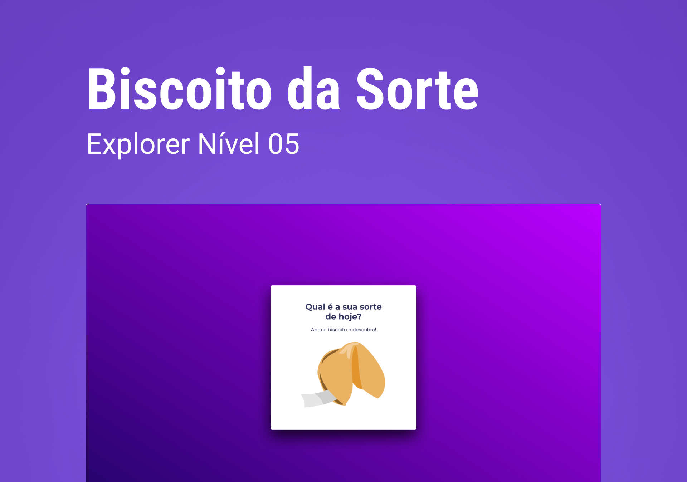

<h1 align="center"> BISCOITO DA SORTE</h1>

Este é mias um projeto para estudos do curso da Rocketseat, o Explorer.  

  <a href="#-tecnologias">Tecnologias</a>&nbsp;&nbsp;&nbsp;|&nbsp;&nbsp;&nbsp;
  <a href="#-projeto">Projeto</a>&nbsp;&nbsp;&nbsp;|&nbsp;&nbsp;&nbsp;
  <a href="#-layout">Layout</a>&nbsp;&nbsp;&nbsp;|&nbsp;&nbsp;&nbsp;
  <a href="#memo-licença">Licença</a>

  

 

  

## 🚀 Tecnologias

Esse projeto foi desenvolvido com as seguintes tecnologias:

- HTML e CSS
- JavaScript
- Git e Github
- Figma

## 💻 Projeto

O Biscoito da sorte é uma aplicação que ao clicar no biscoito gera uma frase motivacional.

- [Acesse o projeto finalizado, online](https://gustavopareschi.github.io/BiscoitodaSorte)

## 🔖 Layout

Você pode visualizar o layout do projeto através [DESSE LINK](https://www.figma.com/file/jIVGLok43fE9LMerSzKp4s/Biscoito-da-Sorte-(Community)?node-id=0%3A1&t=CJOLHHAsWbr7uikP-0). É necessário ter conta no [Figma](https://figma.com) para acessá-lo.

## :memo: Licença

Esse projeto está sob a licença MIT.

---

Feito com ♥ by Rocketseat :wave: [Participe da nossa comunidade!](https://discord.gg/rocketseat)